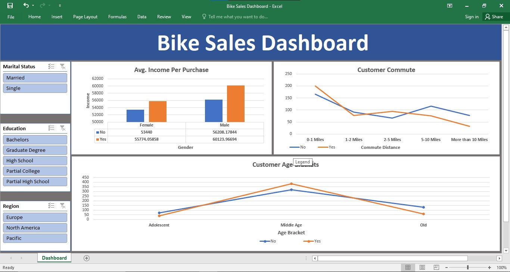

# Bike Sales Analysis - Excel Dashboard
## Project Overview
This project analyzes bike sales data to understand customer demographics, purchasing behavior, and factors influencing bike purchases. The analysis is performed using Microsoft Excel, and an interactive dashboard is built to present clear, business-focused insights.
## Objective
* Analyze bike purchase behavior across different customer segments
* Identify the impact of income, age, and commute distance on bike purchases
* Understand demographic trends based on region, gender, and marital status
* Build an interactive Excel dashboard for quick insights

## Dataset Description
The dataset contains customer-level sales and demographic information.

Key Columns Include:
* Age
* Gender
* Marital Status
* Income
* Region
* Education
* Commute Distance
* Bike Purchased (Yes/No)
The data is structured to enable segmentation and comparative analysis across multiple dimensions.

## Tools & Techniques Used
* Microsoft Excel
* Data Cleaning & Formatting
* Pivot Tables & Pivot Charts
* Slicers for interactive filtering
* Dashboard design and layout

## Dashboard Features
The Excel dashboard highlights:
* Bike purchase comparison (Purchased vs Not Purchased)
* Average income analysis by bike purchase status
* Age group distribution of customers
* Purchase trends based on commute distance and region
* Interactive slicers for dynamic filtering

## Key Insights
* Customers with higher average income are more likely to purchase bikes.
* Middle-aged customers form the largest segment of bike buyers.
* Shorter commute distances show higher bike purchase rates.
* Regional and demographic factors significantly influence purchasing decisions.

## Dashboard Preview

## Conclusion
This project demonstrates how Excel can be used to analyze customer data and derive meaningful business insights. The dashboard enables stakeholders to quickly identify target customer segments and factors that drive bike sales.
